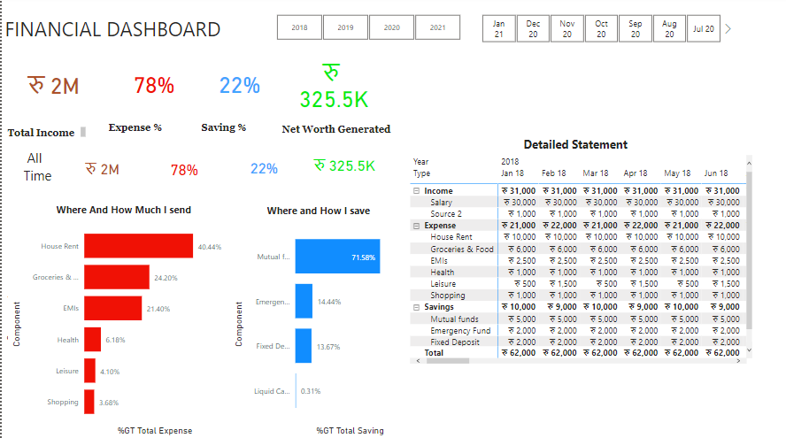
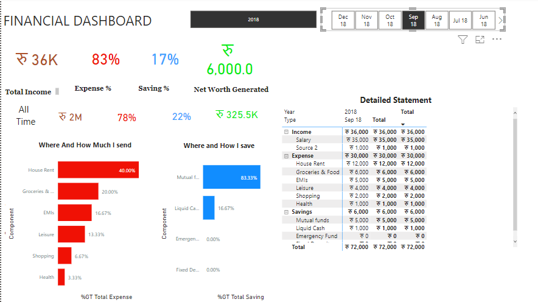
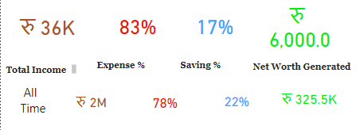
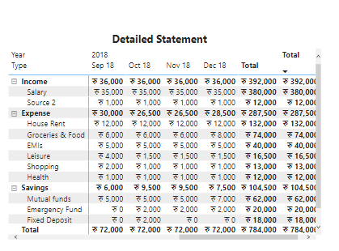
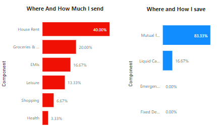
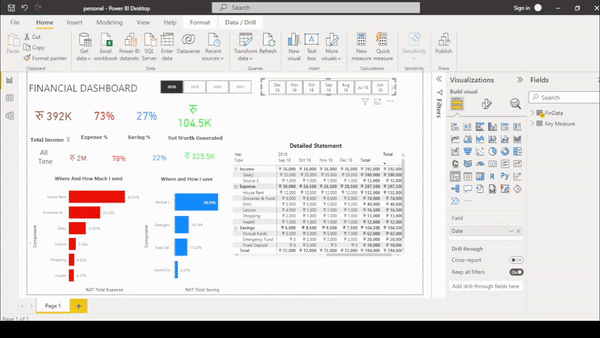

# Personal Finance Dashboard Build With Power BI

### App Screenshot



### Summary
Personal Finance Dashbord Project is done to find out how much we send in our day to day life. This project is done inorder to learn Power BI and to know visually that what is the ratio of my income, saving, expendicture and much more. The main aim of this project is to visualize personal income, expendicture, savings and help me saving more money in upcomming years.

### Motivation

The main motivate to develop this project is to enhance my knowledge and to get internship in Data Science.


## Roadmap

- Taking Data

- Preprocessing Data

- Using formula to calculate required information

- Displaying formulas result for visualization in Power BI software

## Deployment

To deploy this project in local host follow following steps

```bash
  download and install the Power BI app in your system
```
```bash
  Open file inside Power BI app
```

## Dataset
Data set Link: Excel csv file added in Project folder

### App Screenshot







## Demo



## Authors

- [@dipeshadhikarioffical](https://www.github.com/dipeshadhikarioffical)


## 🛠 Skills Gained
Power BI, Excel


## 🔗 Follow Me On

[](https://www.linkedin.com/in/dipeshadhikarioffical/)
[](https://facebook.com/dipeshadhikarioffical)


